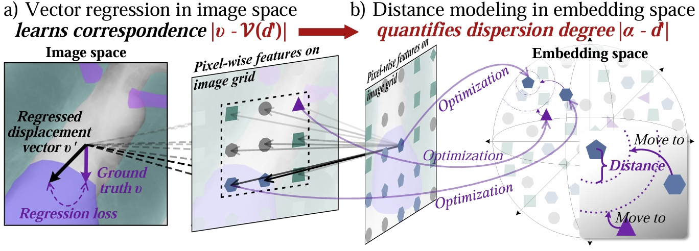
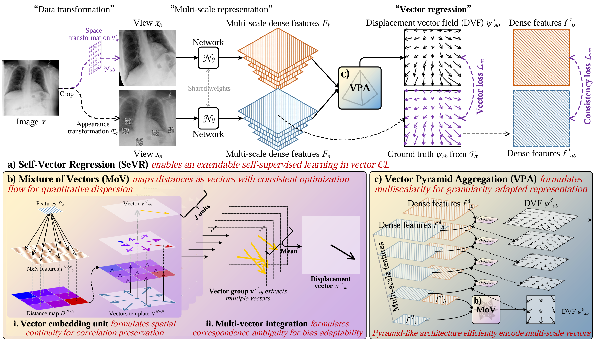

---

**Vector Contrastive Learning (VCL)** is a new contrastive framework that learns *vector-based relationships* between features instead of binary “close/far” classification. It’s designed for **pixel-wise self-supervised pretraining**, especially in **medical vision** (2D/3D, multi-modal imaging).

---

> [**Vector Contrastive Learning For Pixel-Wise Pretraining In Medical Vision**](https://arxiv.org/abs/2506.20850),  
> [Yuting He](https://yutinghe-list.github.io/), [Shuo Li](https://scholar.google.com/citations?user=6WNtJa0AAAAJ&hl=en)*,  
> In: Proc. International Conference on Computer Vision (ICCV), 2025,  
> *arXiv preprint ([arXiv 2506.20850](https://arxiv.org/abs/2506.20850))*

## ✨ Highlights

> **Vector Contrastive Learning (COVER)** — A geometry-aware self-supervised framework  
> that learns *vector relationships* rather than binary similarities.

---

### 🧭 1. From Binary Contrast → Vector Regression
Traditional contrastive learning minimizes similarity distance between positive pairs and maximizes it for negatives — a **binary** paradigm. **COVER** transforms this into a **vector regression task**, where each pixel/voxel learns a *displacement vector* representing **direction** and **magnitude** toward its correspondence.

  
   
  <em>Binary contrast collapses geometry; COVER learns geometric relationships in feature space.</em>

---

### 🔄 2. Controlling Feature Dispersion
Conventional contrastive learning often suffers from **feature over-dispersion** — pixels of the same semantic class get scattered in embedding space. COVER introduces *vector constraints* to **quantify and regularize** dispersion, preserving intra-class structure while maintaining discriminability.

---

### 🧩 3. The COVER Framework (COntrast in VEctor Regression)

A unified pretraining pipeline that integrates:
- 🌀 **Self-Vector Regression (SeVR)** — Generates view transformations and displacement vector fields (DVFs) as self-supervision, eliminating annotation dependence.  
- 🧮 **Mixture of Vectors (MoV)** — Learns a continuous mapping between feature distance and displacement vectors, capturing spatial continuity and correspondence ambiguity.  
- 🌐 **Vector Pyramid Aggregation (VPA)** — Multi-scale vector prediction and fusion to encode both local and global structural relations.

  
   
  <em>The COVER pipeline: vector-based contrastive pretraining with multi-scale aggregation.</em>

---

### 🧬 4. Geometry-Aware Representation Learning
By learning **how** and **where** pixels correspond rather than just **if** they correspond, COVER captures geometric transformations, structural continuity, and spatial semantics — crucial for dense prediction tasks like segmentation and registration.

---

### 📈 5. Broad Applicability
- Designed for **2D** and **3D** medical imaging (CT, MRI, US, X-ray)  
- Supports **dense prediction** tasks: segmentation, registration, classification  
- Applicable to multi-modal and potentially **natural image** domains  
- Demonstrated **consistent performance gains** across 8 downstream benchmarks

---

### 💡 TL;DR

> **COVER = Contrastive Learning → Vector Regression**  
> From “Are they the same?” → **“How far and in which direction should they align?”**  
>  
> ✔️ Geometry-aware  
> ✔️ Structure-preserving  
> ✔️ Annotation-free self-supervision  

---

## 🛣️ Roadmap

We’re continuously improving **COVER** to make it more general, modular, and scalable for diverse pixel/voxel-wise self-supervised learning tasks.

| Status | Feature / Goal | Description |
|:------:|:----------------|:-------------|
| ✅ | **COVER 2D Implementation** | Core framework for 2D pixel-wise vector contrastive pretraining |
| ✅ | **COVER Loss Functions** | Includes vector regression |
| 🧩 | **COVER 3D Support** | Extend to 3D volumetric (CT/MRI) pretraining with voxel-level displacement regression |
| 🔜 | **Pre-trained Weights Release** | Release pretrained models on ChestXray datasets |
| 🔜 | **Benchmark Suite** | Provide unified training and evaluation scripts for downstream tasks |
| 🚧 | **Multi-Modal Extension** | Extend COVER to PET/CT and MRI/US cross-modal learning |
| 🚧 | **Video Representation Learning** | Apply COVER’s vector regression to temporal frame relationships |
| 💡 | **Natural Image Experiments** | Generalize COVER beyond medical imaging to natural datasets |
| 🧠 | **Hugging Face Hub** | Host pretrained checkpoints and demo notebooks for community usage |

---

